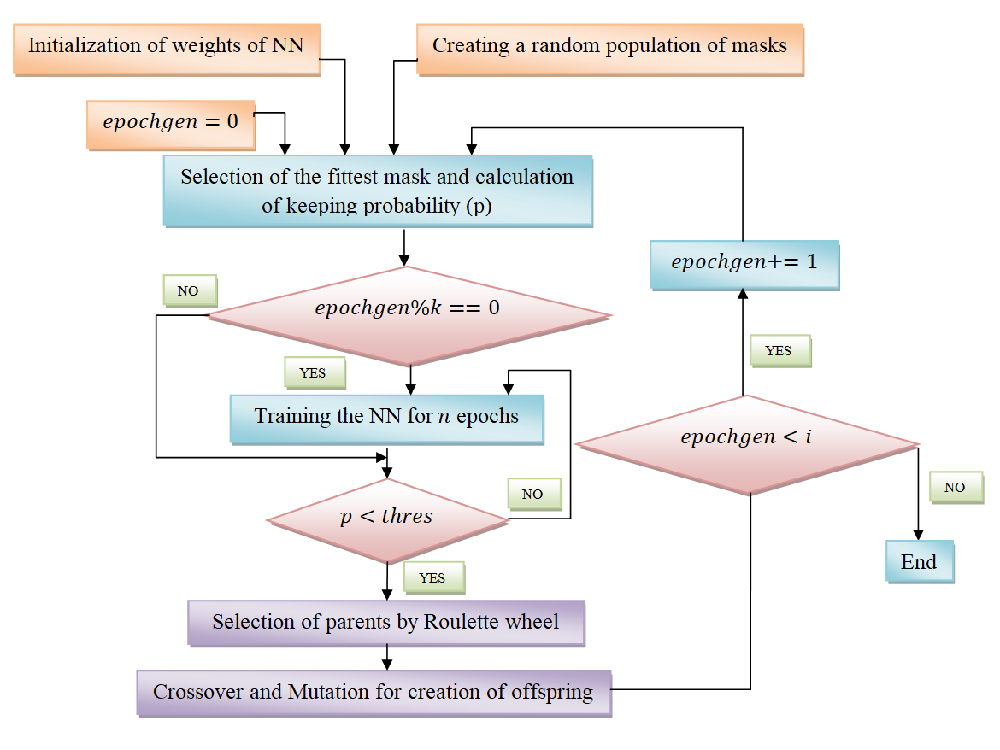

# Genetic-Dropout
A new  modification to dropout regularization scheme using genetic algorithm and validated on script identification data
 Inverted dropout is one of the extensively used methods applied as a regularization technique in neural network. It randomly drops off neurons during the training process with a particular probability distribution. This naive way of dropping random neurons without taking into account the contribution of the neuron towards decision making process has motivated us to propose **Genetic Dropout**, which uses masks evolved using Genetic Algorithm such that during the training process, attention is given to those neurons which are better performers and makes them even better. The effectiveness of **Genetic Dropout** is assessed on the problem of handwritten script classification from document images and results are compared with a simple feed forward neural network with or without inverted dropout. The results show a 7.3% increase in overall classification accuracy compared to a simple feed forward network for both text line-level and word-level datasets.

We propose a new modification to the dropout strategy called the Genetic Dropout which very efficiently provides attention to only those neurons which perform well and makes them even better thus making the dropout layer more smarter and robust. This, in some cases, provides promising results and it has successfully reduced the learnable parameters of the NN making it more concise and efficient. Previously defined features from the script identification dataset are used for training the NN.
## Flowchart:
  
 
 
